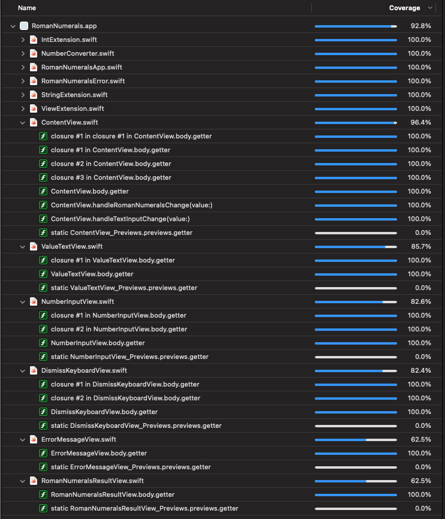

#  Roman Numerals

I created this as a way to demonstrate a basic SwiftUI app that can take a valid integer and convert it into a Roman Numeral. The Roman Numeral must be within the range of 1 - 3,999 to satisfy character repetition rules.

## Design Approach

I made the following assumptions with my user experience. There are other approaches one could take that would be equally valid, I do include my reasoning for these choices.

- The user is restricted to their entry as best as possible by OS features, such as a numeric keyboard on an iPhone.
- However, iPad users are not restricted in this fashion, and all users are free to paste in content from other sources. Due to this, I have made use of text entry validation
- My validation consists of removing invalid text from the string, such that the user will never see it appear during use of the app
- When invalid data is provided, an error is presented to the user, providing guidance about what went wrong
- I have based my numeral range at 1 to 3,999. This is because Roman numerals do not allow for four consecutive characters, thus rendering 4,000 as an invalid number.
- Negative numbers are not supported

## Approach

### Interface

I opted for a `SwiftUI` based app because this is what I spend the majority of my time in now and am comfortable with it. 

The results are displayed immediately to the user without the need to press a button. This is due to most users now expecting instant results, so I did not include any form of a submission action to reduce friction for the user.

### Conversion

The primary function that handles the conversion is a `static` function, since no state is required to perform the operation. Additional effort was made to optimize performance by minimizing the need to instantiate the `Pair` array each time the function was called.

It returns a `Result` type so that it is easy to unpack values and errors.

### Constants

The constant values for `RomanNumeralRange` are part of an `Enum`. This helps ensure the values are properly scoped, and follows Apple's suggestion for these as documented in their Swift instructional books.

### Extensions

I make extensive use of extensions. This serves several uses:
- It cleans up functions by pushing code into other files
- It supports reuse
- It makes it easier to test the relevant code, as unit tests can target the specific extensions

### Errors

I created three errors that can be shown to the user.
- `invalidInput`
- `numberTooHigh(Int)`
- `numberTooLow(Int)`

These are part of an `Enum` and have a computed property representing their message. For the range errors, they also capture the user provided value so it can be presented to the user for informational purposes as part of the message.

### Localization

All `String` values presented to the user are wrapped for localization.

## Testing

The app contains extensive unit and UI testing to cover normal usage, as well as edge cases.

### Scheme and Test Plan

The app contains two schemes, with the `Test` scheme having an associated `TestPlan`. This test plan runs additional checks for address and thread sanitization as well as memory management.

By placing this more involved test in its own scheme, it makes it possible for the developer to run a faster test pass with the default app scheme. This would ideally be utilized by a CI/CD solution.

### Unit Tests

The included unit tests are separated by target, with tests for the `Int` and `String` extensions, as well as the `NumberConverter`.

### UI Tests

The included UI tests focus on four specific cases:
- The user properly enters a valid value and dismisses the keyboard
- The user enters values that are too low or too high
- The user pastes in a text value
- The user starts in one orientation, then exits and resumes in another

### Manual Testing

The app was tested on physical devices and no obvious issues presented themselves. Additionally, instrumentation tests were run and did not encounter any issues.

### Coverage

If you exclude the `PreviewProvider` code, the included tests are close to 100% coverage.

## Misc

Code style follows my personal views, but has also been enforced through `swiftformat` and `swiftlint`.

No external libraries were required for this.

No logging was included, but can be easily integrated to support debugging.
